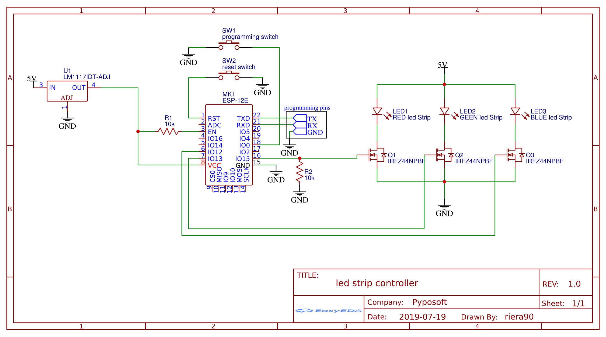
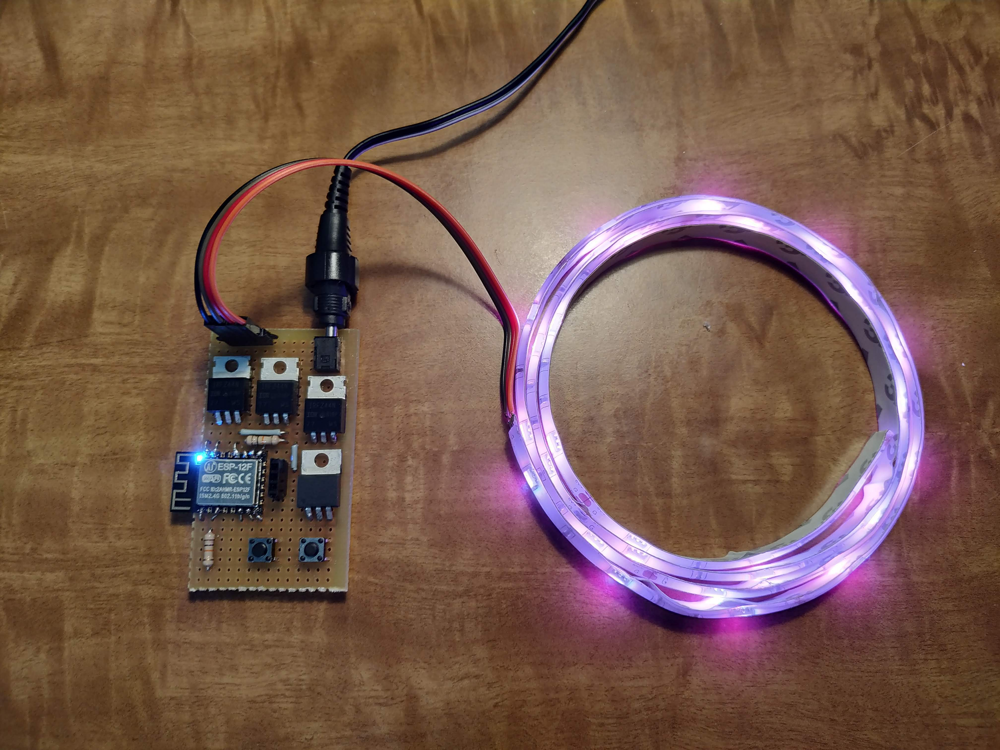
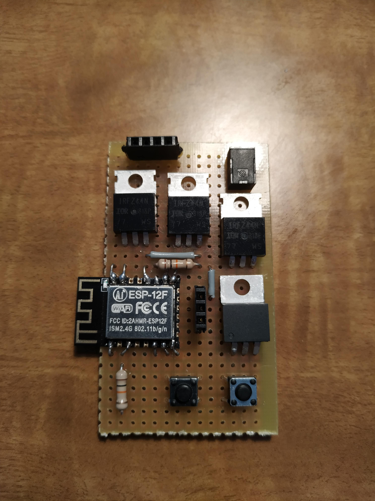
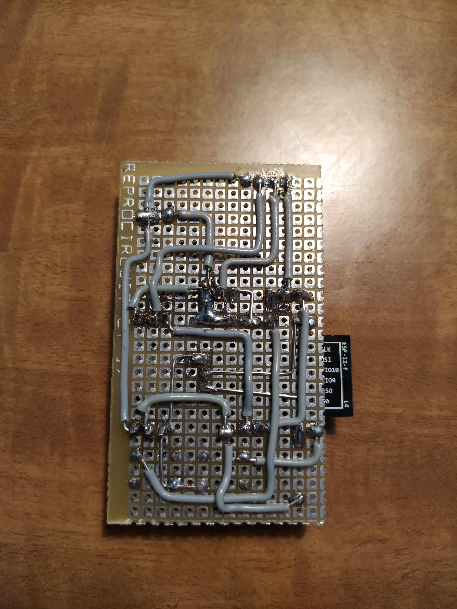

# Customizable alarm clock

**Difficulty: Medium**  
**Economic cost: Nothing**  
**Dependencies:**
- Nightstand Display
- Speakers

**Integration** None
## Description
An alarm snooze/stop button and a display to show the get out of home time and whatever information you want, like weather, and traffic

## You will need

### Components
- resistors:
    + 2x 10kΩ
- MOSFET:
    + 3x IRFZ44N
- microcontrollers:
    + 1x ESP8266 (ESP-12F)
- 2x button
- 1x LM1117T 3.3V regulator
- 1x 1x4 pin socket (led socket)
- 1x 1x3 pin socket (programming socket)
- 1x power jack

### Extra consumables
- 1x 5V power supply
- dot matrix PCB
- wires
- solder

### Tools
- soldering iron / station
- Multimeter
- USB to TTL converter
- a pc

## Diagram

## Wiring

