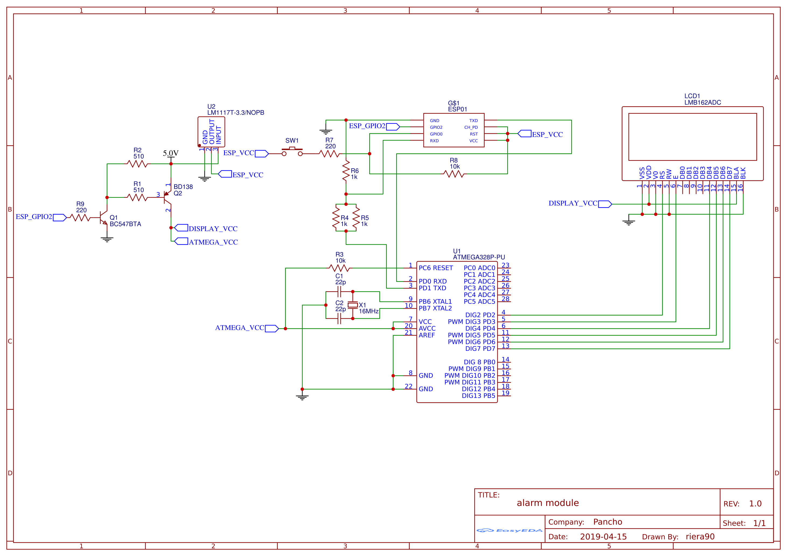
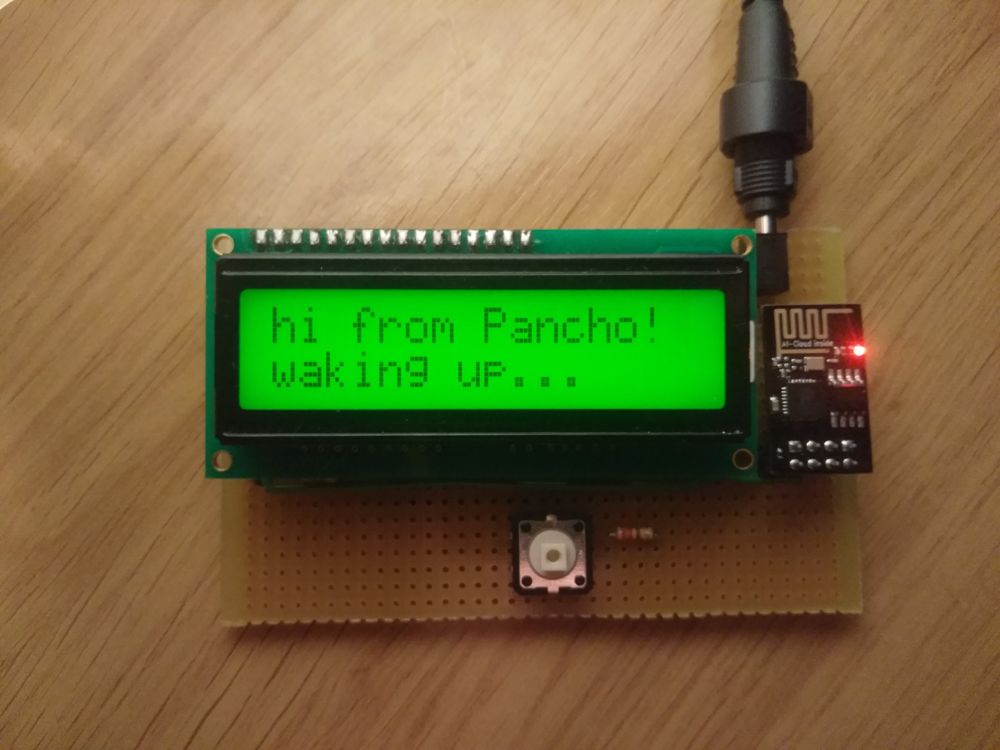
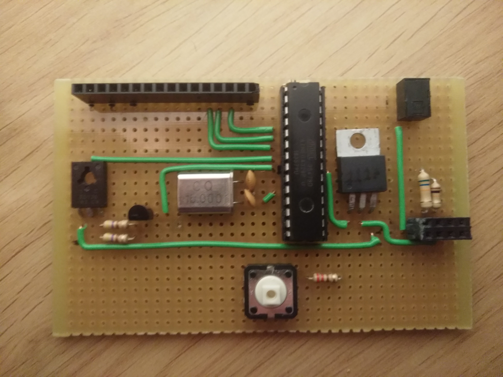
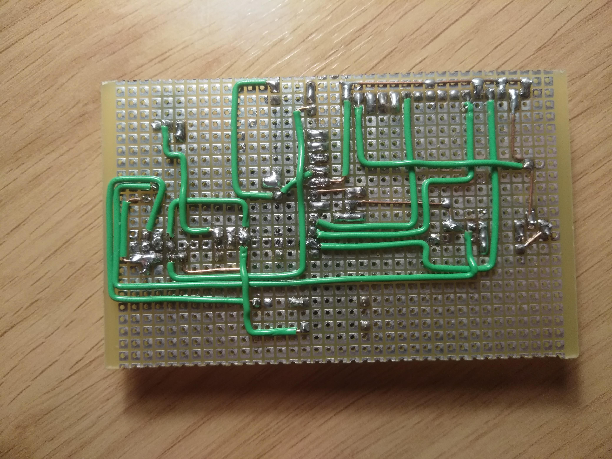

# Nightstand display and alarm stopper

**Difficulty: medium-high**  
**Economic cost: low (15-20€)**  
**Dependencies:** None  
**Integration** None

## Description
An alarm snooze/stop button and a display to show the get out of home time and whatever information you want, like weather, and traffic

## You will need

### Components
- resistors:
    + 2x 220Ω
    + 2x 510Ω
    + 3x 1kΩ
    + 2x 10kΩ
- capacitors:
    + 2x 22pf ceramic capacitor
- transistors:
    + 1x BD138
    + 1x BC547
- microcontrollers:
    + 1x ATmega328P
    + 1x ESP8266 (ESP-01) 512K/1MB
- 1x button
- 1x lcd display (I use the lmb162abc)
- 1x LM1117T 3.3V regulator
- 1x 16Mhz crystal oscillator
- 1x 28 pin dip socket
- 1x 2x4 pin socket

### Extra consumables
- 1x 5V power supply
- dot matrix PCB
- wires
- solder

### Tools
- soldering iron / station
- Multimeter
- USB to TTL converter
- an arduino uno
- a pc

## Diagram

## Wiring

